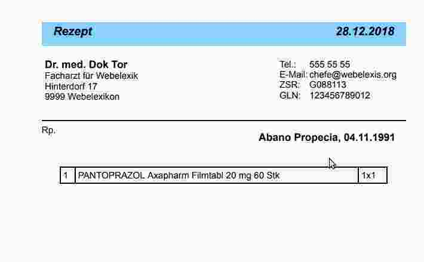

# Webelexis Benutzerhandbuch

## Einleitung

Dieses Handbuch führt Sie durch die Installation und Verwendung eines Webelexis-Systems. Webelexis besteht aus einer 'Server'-Komponente, welche zwischen der Elexis-Datenbank und der Benutzerschnittstelle vermittelt, und einer 'Client'-Komponente, welche eben diese Benutzerschnittstelle aufbaut. Grundsätzlich sind beliebige Client-Programme möglich. Standardmässig wird der Server aber ein Programm bereitstellen, welches von Ihrem Web-Browser geladen und ausgeführt wird. Dabei ist es grundsätzlich gleichgültig, ob dieser Browser auf einem Smartphone, einem Tablet, einem Laptop oder einem Desktop-Computer läuft, und es ist auch gleichgültig, wo auf der Welt dieses Endgerät sich befindet, solange es sich nur via Internet mit der Server-Komponente verbinden kann.

Dies hat selbstverständlich verschiedene Sicherheits-Implikationen, auf die ich später noch eingehen werde. Zunächst möchte ich Ihnen ans Herz legen, dass Sie:

* Den Webelexis-Server so installieren, dass er nicht via Internet, sondern nur über das lokale Netzwerk erreichbar ist.

* Die Einrichtung nur dann selber vornehmen, wenn Sie genug Sachkenntnis haben, um sicherzustellen, dass die Erreichbarkeit so beschränkt ist.

* Eine gute und korrekt konfigurierte Firewall zwischen Ihrem Praxisnetz und dem Internet einrichten bzw. einrichten lassen.

* Sicherheitsrichtlinien erstellen und durchsetzen, die möglichst weitgehend sicherstellen, dass keine Schadprogramme das Praxisnetz erreichen können. Dazu gehört zum Beispiel ein Verbot für die Mitarbeiter, Software auf den Praxiscomputern einzurichten und private E-Mails zu lesen. Dazu gehört Wahl eines Mailproviders für Praxis-Emails, der Schadsoftware möglichst schon vor dem Herunterladen erkennt und eliminiert. Dazu gehört auch und besonders, dass kein Praxismitarbeiter mit Administratorrechten arbeitet. Diese Auflistung ist nicht abschliessend.

Grundsätzlich  ist es empfehlenswert, die Serverkomponente von einer Person mit entsprechender Sachkenntnis einrichten zu lassen. Dieses Handbuch beginnt daher mit der Bedienung des Clients. Die Einrichtung des Servers wird im zweiten Teil beschrieben.

## Der Client

### Vorbedingungen

Sie benötigen ein internetfähiges Gerät mit einem modernen Browser. Empfehlenswert (und am besten getestet) sind [Google Chrome](https://www.google.com/chrome/) (Version 71 oder neuer) und dessen freier Bruder [Chromium](https://www.chromium.org/Home) (Version 72 oder neuer. Es spricht aber nichts dagegen, einen anderen Browser auszuprobieren, allerdings sollten Sie dann, wenn etwas nicht so funktioniert, wie es in diesem Handbuch beschrieben ist, zunächst testen, ob das Problem auch mit Chrome/Chromium auftritt, bevor Sie Fragen dazu stellen. Von der Nutzung des Internet Explorers und von Edge rate ich allerdings für Webelexis generell ab; es sind relativ viele Probleme dieser Browser mit JavaScript Anwendungen bekannt.

Damit kommen wir zur zweiten Vorbedingung: Sie müssen Javascript auf dem Browser zulassen, sonst kann das Programm nicht starten. Dies ist heutzutage bei den meisten Browsern ausser dem TOR-Browser ohnehin die Grundeinstellung.

Ausserdem benötigen Sie eine von diesem Client aus erreichbare laufende Elexis-Installation ab Version 3.4 oder Elexis-Ungrad 2018, und zwar mit einer Mysql- oder MariaDB Datenbank. PostgreSQL wird derzeit leider NICHT unterstützt. Wenn Sie das ändern wollen, können Sie das via Sponsoring oder Eigenentwicklung tun.

Das Betriebssystem ist egal. Webelexis läuft gleichermassen unter Linux, Windows und macOS.

### Start

Richten Sie den Browser auf http://IhrServer. (Ich werde in diesem Handbuch immer 'IhrServer' schreiben, wenn ich die Adresse Ihres Webelexis-Servers meine. Diese Adresse wurde Ihnen bei der Einrichtung des Servers mitgeteilt. Es kann entweder eine Nummer wie '192.168.0.1' oder ein symbolischer Name wie 'PraxisServer' sein, oder auch ein Internet-Name wie 'webelexis.ihrepraxis.ch'. Im letzteren Fall beginnt die Adresse dann vermutlich mit https:// statt http://, oder benötigt einen zuvor aufgebauten SSH- oder VPN-Tunnel, um zu funktionieren.

Sie werden dann von diesem Bildschirm begrüsst:

### Benutzerkonfiguration

Grundsätzlich erwartet Webelexis, dass alle Anwender als Kontakte in der Elexis-Datenbank erfasst sind. Einzige Bedingung: Der Kontakt muss eine E-Mail-Adresse erfasst haben. Als Webelexis-Anwender kommen nicht nur Elexis-Anwender in Frage, sondern alle in Elexis erfassten Kontakttypen, auch etwa Patienten. Dies ist darum so, damit man Patienten beispielsweise ermöglichen kann, selber Termine einzutragen oder eigene Laborwerte und Dokumente einzusehen. (Diese Funktionen sind bisher aber noch nicht vorhanden)

Als erster Benutzer muss immer der Administrator eingetragen werden. Dieser trägt den passenden Namen 'admin' und wird beim ersten Start des Servers automatisch erstellt. Er ist als einziger Anwender kein Elexis-Kontakt (zumindest nicht zwingend). Beim ersten Start des Servers kann er auf der Server-Konsole sein Passwort eingeben.

Wenn Sie sich als 'admin' einloggen, können Sie anschliessend von der Webelexis-Oberfläche aus weitere Anwender erstellen und verwalten.

### Briefvorlagen

In Webelexis sind Briefvorlagen in HTML erstellt. Das macht das System flexibler - man ist nicht mehr auf ein Textprogram wie OpenOffice oder Word angewiesen, dafür ist das Erstellen von Vorlagen aber ein wenig schwieriger. In `data/sample-docbase/templates` finden Sie einige Beispiele zum Anpassen. Hier nur kurz das Prinzip:

Ein Rezept, das so aussehen soll:

Kann entweder mit html oder mit pug definiert werden. [Pug](https://pugjs.org/api/getting-started.html) ist eine Seitenbeschreibungssprache, die sich nach HTML complilieren lässt. Der Vorteil ist, dass weniger Schreibarbeit nötig ist, und dass die Dateien, wenn man den Aufbau einmal verstanden hat, übersichtlicher sind, als die HTML-&lt;Klammerwüsten&gt;. 
Hier zeige ich die Rezeptvorlage mit pug:

Zunächst eine gemeinsame Basis für alle Dokumente im Format A5:

~~~css
//- a5.pug
doctype html
html(lang="de")
  head
    meta(charset="utf-8")
    title= sitename
    link(rel="stylesheet" href="/a5styles.css")
  body
    heading.heading
      block doctitle
      span.topright [Datum.heute]
    main
      block content
~~~

Dann eine Vorlage fürs Rezept, die diese Basis-Vorlage erweitert:

~~~css
//- rezept.pug
extends a5.pug

block doctitle
  span.topleft Rezept

block content
  .leftrow
    span(style="font-size:16px;font-weight:bold;")= mandator.name
    br
    span= mandator.subtitle
    br
    span= mandator.street
    br
    span= mandator.place
  .rightrow
    table.header
      tr
        td Tel.:
        td #{mandator.phone}
      tr
        td E-Mail:
        td #{mandator.email}
      tr
        td ZSR:
        td #{mandator.zsr}
      tr
        td GLN:
        td #{mandator.gln}
  .payload
    span Rp.
    .concern  [Patient.Bezeichnung1] [Patient.Bezeichnung2], [Patient.geburtsdatum]
    .contents [liste][zusatz]

~~~

Eine wesentliche Rolle spielt auch das css-stylesheet, das am Anfang von a5.pug eingelesen wird:

~~~css
@page{
  size: 148mm 210mm;
}
body {
  /* Definition der Schriftart und -grösse für den ganzen Text */
  font-family: Helvetica, Sans-Serif;
  font-style: normal;
  font-size: 14px;
  text-align: left;
  width: 148mm;
  height: 209mm;
  margin-left: 10mm;
  margin-right: 15mm;
  position: absolute;
}

.heading {
  /* Stil für Seitentitel */
  font-style: oblique;
  font-size: 18px;
  font-weight: bolder;
  text-align: center;
  background-color: lightskyblue;
  color: black;
  position: absolute;
  top: 0px;
  left: 0px;
  width: 100%;
  height: 2em;
}

/* Text oben links */
span.topleft{
  position:absolute;
  left:1em;
  top:4px;
}
/* Text oben rechts */
span.topright{
  position:absolute;
  right:1em;
  top:4px;
}
/* Linke Spalte des Kopfbereichs */
.leftrow {
  position: absolute;
  top: 4em;
  left: 5px;
  width: 74mm;
  height: 45mm;
  overflow: hidden;
  text-align: left;
}

/* Rechte Spalte des Kopfbereichs */
.rightrow {
  position: absolute;
  top: 4em;
  right: 5px;
  width: 50mm;
  overflow: hidden;
  text-align: left;
}

/* Betreff (Patientenname) */
.concern {
  font-weight: bold;
  font-size: 16px;
  text-align: left;
  position: absolute;
  top: 1em;
  right: 1em;
}

/* Variabler Datenteil */
.payload {
  position: absolute;
  top: 40mm;
  bottom: 5mm;
  width: 100%;
  border-top: solid black 1px;
  padding-top:5px;
  /* border: solid black 1px; */

}

/* Eigentlicher Inhalt */
.contents {
  position: absolute;
  top: 5em;
  left: 2em;
  right: 2em;
  overflow: hidden;
}

/* Tabelle im Kopfbereich (ohne Linien) */
table.header {
  border: 0;
  text-align: left;
  padding: 0;
}

table.header tr{
  border: 0;
  padding: 0;
}
table.header td{
  border: 0;
  padding: 0;
}

/* Tabelle im Inhaltsbereich */
table {
  /* Stil für tabellarische Daten */
  border-collapse: collapse;
  padding: 8px;
  width: 100%;
}

table,
th,
td {
  /* Gemeinsame Formatierung aller Tabellenzellen, kann ev, weiter unten modifiziert werden */
  border: 1px solid black;
  text-align: left;
}

.rowheader {
  /* Die erste Spalte */

  text-align: left;
  font-weight: normal;
  background-color: #e6f7ff;

}

th.group {
  /* Zeilen mit Gruppennamen */
  background-color: #e6e6e6;
  page-break-after: avoid;
  /* Kein Seitenumbruch direkt nach dem Gruppentitel */
}

td {
  /* Tabellenzellen, alle gemeinsam */
  padding: 4px;
  margin: 2px;
}

~~~

Wenn Sie eine Vorlage geändert oder eine neue Vorlage erstellt haben, müssen Sie den Server neu starten, damit er die Vorlagen nach HTML umwandelt und einliest.

Alternativ können Sie Vorlagen auch direkt als HTML erstellen (also rezept.html statt rezept.pug schreiben). In diesem Fall müssen Sie die gleichnamigen .pug Dateien aber entfernen, sonst wird Ihr HTML beim nächsten Start wieder überschrieben.

### Makros

Ähnlich wie bei Elexis können Sie auch bei Webelexis Makros im Konsultationstext eingeben. Im Gegensatz zu Elexis können Makros bei Webelexis aber nicht nur Textkürzel expandieren und Leistungsblöcke verrechnen, sondern auch differenziertere kontextabhängige Aktionen auslösen. Standardmässig sind folgende Makros eingerichtet:

* Wenn ein Makro der Name eines Leistungsblocks ist, wird dieser verrechnet.

* Textkürzel werden expandiert (z.B. kons$).

* grössereZahl/kleinereZahl wird als Blutdruckwert interpretiert und so als Messwert f den aktuellen Tag eingetragen. Beispiel: 130/80.

* grössereZahl/kleinereZahl/nochEineZahl wird aös BD/Puls interpretiert und eingetragen

* kleinereZahl/grössereZahl wird als Gewicht/Grösse interpretiert und zusammen mit dem errechneten BMI als Messwert eingetragen.

* Zahl%/Dezimalzahl wird als Quick/INR interpretiert.

* BZZahl wird als Blutzuckerwert interpretiert.

Die Definition von Makros ist durch diese vermehrten Möglichkeiten leider komplexer geworden. Man kann sie auch nicht mehr von der Benutzeroberfläche aus erstellen, sondern muss sie als Funktionen in user/macrodefs.ts schreiben.

## Der Server

### Docker-basiert

Dies ist die einfachste Variante, Webelexis zum Laufen zu bekommen. Installieren Sie [Docker](https://www.docker.com/) auf Ihrem Server (der durchaus derselbe Server wie der von Elexis sein kann, es aber nicht zwingend muss). 
